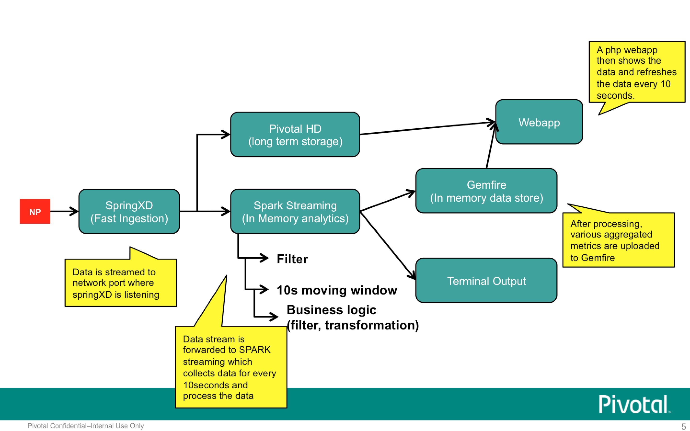
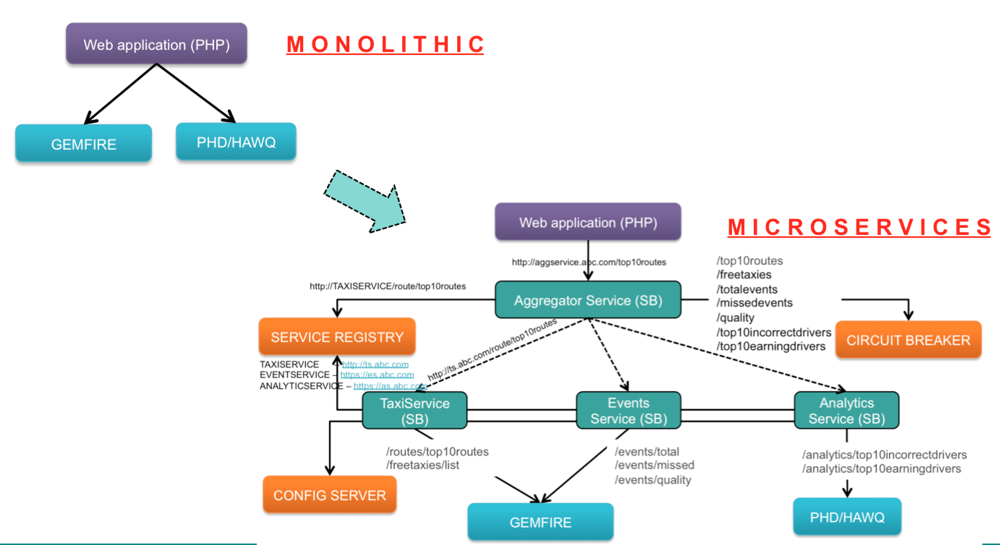
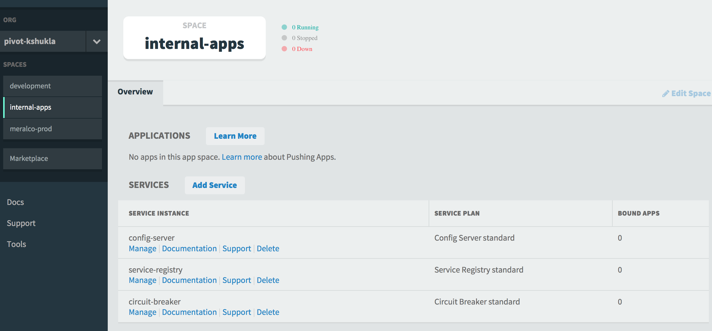
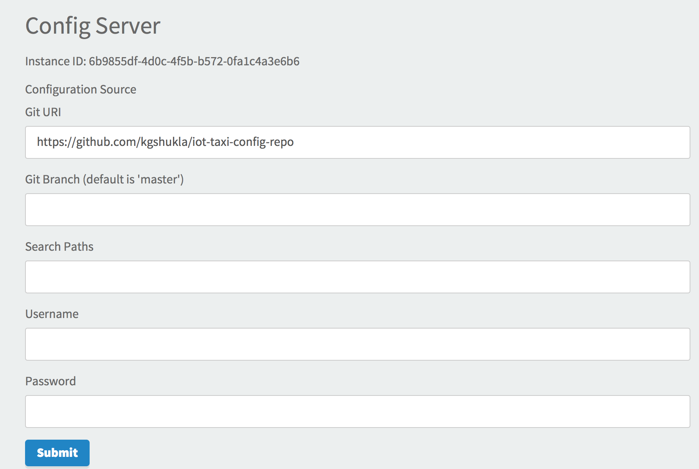
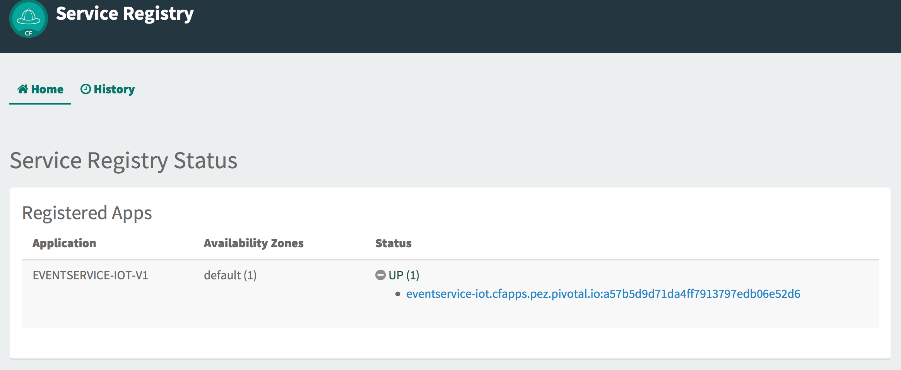
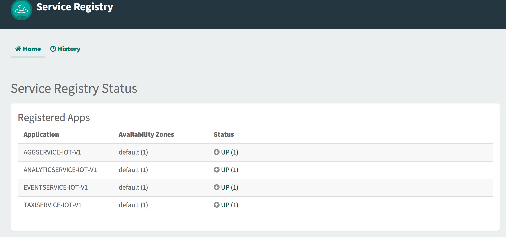
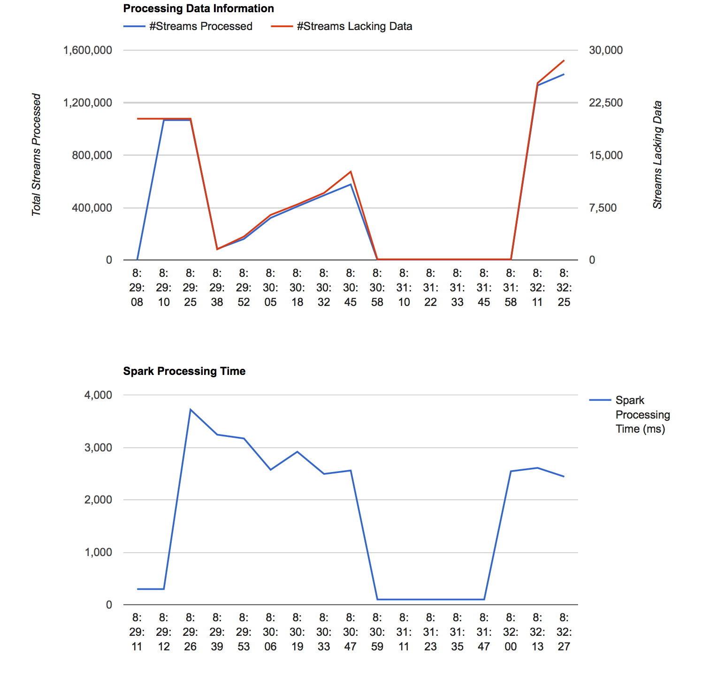
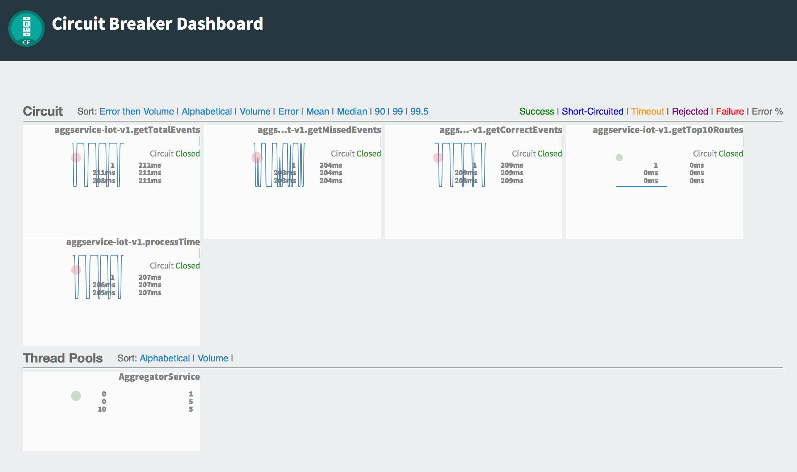

# Realtime-Streaming-PCF-Microservices-BDS

This demo aims to solve problem that appeared in DEBS challenge 2015

http://www.debs2015.org/call-grand-challenge.html

Stream of taxi data comes in real time for new york region. Region is to be divided into areas, each measuring 300mx300m. Following questions needs to be solved in real time

image::images/problemstmt.jpg[]

Question 1 - For every 10 seconds, find out the top 10 routes where taxies are plying the most from one area to another area.

Question 2 - For every 10 seconds, find out the top 3 routes (areas) 

Question 3 - For every 10 seconds, find out free taxies (show only 50 in the map) available in the region

Question 4 - For every 10 seconds, find out how much data is incorrectly reported by taxi drivers

Question 5 - For every 10 seconds, find out how much time does your product takes to compute the above 4 things

Below questions need not be answered in real time -

Question 6 - For overall data, find out who are the taxi drivers not reporting the data correctly

Question 7 - For overall data, find out top 10 taxi drivers earning the most

=== Solution Architecture

We use following Pivotal products to implement the solution

a. SpringXD (real time data gets ingested via SpringXD)
b. Spark (real time streams are sent to Spark for computing Q1-5 above)
c. Gemfire (output from Spark goes into Gemfire)
d. PHD/HAWQ (real time data is also sent (via springXD's tap) to PHD so that we could answer Q6 and A7 above)
e. Pivotal Cloud Foundry where we deploy our applications
f. Spring Cloud Services to make microservices driven architecture work
e. Microservices are modeled as Spring Boot applications. The web application is built using PHP and Google Charts. All application are deployed in Pivotal Cloud Foundry

See the below diagram for the stack used. NP stands for network packets so the stream would come as traffic on EC2's network port. SpringXD would be listening to this port.

The below diagram depicts the Microservices based applications. In my earlier link:https://github.com/kgshukla/Realtime-Streaming-PCF-BDS[solution], I created only one application (monolithic application that was based on php and google charts). I have broken down this application into multiple microservices and use spring cloud services (config-server, service-registry and circuit-breaker) to build a resilient and scalable architecture as shown below.

As shown in the image above, we have following microservices

1. EventService - this is a spring boot application that retrieves it's coniguration from config-server (like gemfire host and port to connect to) and exposes few http end points related to events - like how many events (every data in the stream is an event) have been processed, how many events have missing data entries, how much time it takes to process events in a window of 10 second. This service retrieves data from Gemfire.

2. TaxiService - this is a spring boot application that retrieves it's coniguration from config-server and exposes few http end points related to taxi information - like what are the top 10 routes, where are free taxies available in a window of 10 seconds. This service retrieves data from Gemfire.

3. AnalyticSercice - this is a spring boot application that retrieves it's coniguration from config-server and exposes few http end points related to analytic queries - like who are the drivers reporting incorrect data, who are the drivers earning the mostover collected data. This service retrieves data from PHD/HAWQ.

4. AggService (aggregator service) - this is a spring boot application that talks to the above 3 microservices using service-registry. It also utilizes circuit-breaker which gets activated automatically in case any of the microservice fails (due to connectivity to data source, or they are not up or network failure). This service exposes all end points to the web application.

5. PHP based web app - this is a php application that calls AggService's exposed endpoints to retrieve data and show it on a web page. 

All these will be deployed on Pivotal Cloud Foundry.

=== Launch Amazon AMI 

In order to make it simpler, we've created the Amazon AMI to launch instances quickly. This AMI contains Pivotal Big Data Suite components needed in the demo - SpringXD, Spark, Pivotal Hadoop, Pivotal HAWQ and Gemfire. There is no .pem requirement to login in to the EC2 instance once AMI is launced.

Log in to your AWS account and search for "Name" attribute with value "PCF Microservice" (available in Singapore region - ami-7d5c9c1e, US East (N. Virginia) - ami-9d1f51f7 and US West (N. California) - ami-84afc7e4)

- Launch it and make sure you choose m4.xlarge (16GB) instance size. Note: You could also try with t2.large (8GB) - we tried it and it works, however you may experience slowness.

- Auto assign a public IP address

- Add 25 GB SSD storage

- Keep all traffic open on all ports in your security group settings

- No need to choose a key pair.

Once launched, you could ssh to machine using gpadmin/changeme credentials.

=== Start Gemfire locator and server

ssh as gpadmin/changme into your running EC2 instance. Run gfsh command
[source,bash]
----
$ gfsh
    _________________________     __
   / _____/ ______/ ______/ /____/ /
  / /  __/ /___  /_____  / _____  /
 / /__/ / ____/  _____/ / /    / /
/______/_/      /______/_/    /_/    v8.1.0

Monitor and Manage GemFire

gfsh>
----

Start locator now using following command 

gfsh>start locator --name=locator --port=41111 --properties-file=/var/www/html/streamtaxi/gemfire-files/gemfire-server.properties --initial-heap=50m --max-heap=50m

[source,bash]
----
gfsh>start locator --name=locator --port=41111 --properties-file=/var/www/html/streamtaxi/gemfire-files/gemfire-server.properties --initial-heap=50m --max-heap=50m
Starting a GemFire Locator in /home/gpadmin/locator...
....
Locator in /home/gpadmin/locator on ip-172-31-26-122.ap-southeast-1.compute.internal[41111] as locator is currently online.
Process ID: 146328
Uptime: 16 seconds
GemFire Version: 8.1.0
Java Version: 1.7.0_67
Log File: /home/gpadmin/locator/locator.log
JVM Arguments: -DgemfirePropertyFile=/var/www/html/streamtaxi/gemfire-files/gemfire-server.properties -Dgemfire.enable-cluster-configuration=true -Dgemfire.load-cluster-configuration-from-dir=false -Xms50m -Xmx50m -XX:+UseConcMarkSweepGC -XX:CMSInitiatingOccupancyFraction=60 -Dgemfire.launcher.registerSignalHandlers=true -Djava.awt.headless=true -Dsun.rmi.dgc.server.gcInterval=9223372036854775806
Class-Path: /opt/pivotal/gemfire/Pivotal_GemFire_810/lib/gemfire.jar:/opt/pivotal/gemfire/Pivotal_GemFire_810/lib/locator-dependencies.jar

Successfully connected to: [host=ip-172-31-26-122.ap-southeast-1.compute.internal, port=1099]

Cluster configuration service is up and running.
----

Start server now using following command. Make sure you replace <IP_ADDRESS> with EC2 private (and not public) ip address (you could find the ip address by ssh into EC2 instance and then running $/sbin/ifconfig command.

gfsh> start server --name=server1 --cache-xml-file=/var/www/html/streamtaxi/gemfire-files/xml/server-cache.xml --initial-heap=50m --max-heap=100m --J=-Dgemfire.start-dev-rest-api=true --J=-Dgemfire.http-service-port=8081 --J=-Dgemfire.http-service-bind-address=IP_ADDRESS

[source,bash]
----
gfsh>start server --name=server1 --cache-xml-file=/var/www/html/streamtaxi/gemfire-files/xml/server-cache.xml --initial-heap=50m --max-heap=100m --J=-Dgemfire.start-dev-rest-api=true --J=-Dgemfire.http-service-port=8081 --J=-Dgemfire.http-service-bind-address=IP_ADDRESS
Starting a GemFire Server in /home/gpadmin/server1...
----

Make sure you see all the four regions listed below by running "list regions" command

[source,bash]
----
gfsh>list regions
List of regions
---------------
FreeTaxiList
ProcessData
RouteData
TaxiData
----

=== Start SpringXD server and shell

Use following command to run SpringXD - Note: the command will not terminate.

[source,bash]
----
$ export JAVA_OPTS="-XX:PermSize=512m"
$ $XD_HOME/bin/xd-singlenode
----

You should wait and see following output and then proceed further

[source,bash]
----
2015-08-18T04:09:23-0700 1.2.1.RELEASE INFO DeploymentsPathChildrenCache-0 container.DeploymentListener - Path cache event: type=INITIALIZED
2015-08-18T04:09:23-0700 1.2.1.RELEASE INFO DeploymentSupervisor-0 zk.ContainerListener - Container arrived: Container{name='f6641b76-a6d0-4b46-956a-29c891140105', attributes={groups=, host=admin.local.com, id=f6641b76-a6d0-4b46-956a-29c891140105, ip=172.31.26.122, pid=148562}}
2015-08-18T04:09:23-0700 1.2.1.RELEASE INFO DeploymentSupervisor-0 zk.ContainerListener - Scheduling deployments to new container(s) in 15000 ms 
----

Start another terminal and run springXD shell command where you will be creating streams

[source,bash]
----
[gpadmin@admin ~]$ $XD_SHELL/bin/xd-shell
 _____                           __   _______
/  ___|          (-)             \ \ / /  _  \
\ `--. _ __  _ __ _ _ __   __ _   \ V /| | | |
 `--. \ '_ \| '__| | '_ \ / _` |  / ^ \| | | |
/\__/ / |_) | |  | | | | | (_| | / / \ \ |/ /
\____/| .__/|_|  |_|_| |_|\__, | \/   \/___/
      | |                  __/ |
      |_|                 |___/
eXtreme Data
1.2.1.RELEASE | Admin Server Target: http://localhost:9393
Welcome to the Spring XD shell. For assistance hit TAB or type "help".
xd:>

----

Note - SpringXD Flo is also running on http://IPAddress:9393/admin-ui  where you could create streams using drag and drop. In this demo, we would be creating using command line interface.

=== Create SpringXD Streams

Go back to the XD Shell command line and run the following command -

[source,bash]
----
xd:>module list
      Source              Processor           Sink                     Job
  ------------------  ------------------  -----------------------  -----------------
      file                aggregator          aggregate-counter        filejdbc
      ftp                 bridge              counter                  filepollhdfs
      gemfire             filter              field-value-counter      ftphdfs
      gemfire-cq          http-client         file                     gpload
      http                json-to-tuple       ftp                      hdfsjdbc
      jdbc                object-to-json      gauge                    hdfsmongodb
      jms                 script              gemfire-json-server      jdbchdfs
      kafka               scripts             gemfire-server           sparkapp
      mail                shell               gpfdist                  sqoop
      mongodb             splitter            hdfs                     timestampfile
      mqtt                transform           hdfs-dataset
      rabbit                                  jdbc
      reactor-ip                              kafka
      reactor-syslog                          log
      sftp                                    mail
      syslog-tcp                              mongodb
      syslog-udp                              mqtt
      tail                                    null
      tcp                                     rabbit
      tcp-client                              redis
      time                                    rich-gauge
      trigger                                 router
      twittersearch                           shell
      twitterstream                           spark-taxi
                                              splunk
                                              tcp
                                              throughput-sampler
----

You will see that there is a module spark-taxi in Sink. This is nothing but a spark module which has been uploaded already in SpringXD. This spark module is written in java and contains the business logic of getting stream data. Stream data is collected over a window of 10 seconds and then business logic is applied to find out answers of Q1-Q5 and upload the data in Gemfire's region. The jar file is located at /var/www/html/streamtaxi/jar/spark-taxi-0.1.0.jar. 

We will make the source code public soon.

Create your first stream

xd:>stream create --name stream-topx --definition "tcp --outputType=text/plain --decoder=LF | spark-taxi " --deploy

This stream basically listens to all data coming to tcp default port and sending it to the spark module. When you run SpringXD in singlenode configuration, you could also have spark running inside SpringXD. In a real world scenario, Spark will be running separately.

[source,bash]
----
xd:>stream create --name stream-topx --definition "tcp --outputType=text/plain --decoder=LF | spark-taxi " --deploy
Created and deployed new stream 'stream-topx'
xd:>
----

Make sure it is deployed correctly by checking that there are no errors in SpringXD single node terminal 

=== Deploy microservices in Pivotal Cloud Foundry

First you need to clone (git clone) the repository on your laptop. Then run "mvn clean package" (you need to have maven installed on your laptop) inside top directory that should create 4 jar files under following folders - eventservice/target, taxiservice/target, analyticservice/target and aggservice/target.

[source, bash]
----
shuklk2@localhost:Realtime-Streaming-PCF-Microservices-BDS$ mvn clean package
----

Then, you need to have access to Pivotal Cloud Foundry installation that has Spring Cloud Services enabled. 

Login to Pivotal Cloud Foundry instacne

[source,bash]
----
$cf login -a <pivotal cloud foundry api url> --skip-ssl-validation
----

Choose a valid org and space.

Let's quickly create 3 spring cloud services that we would need. You could go to Pivotal Cloud Foundry web console and create these services as well. We would use command line interface to create quickly. You could also run ./scripts/createservice.sh script.

[source,bash]
----
$cf create-service p-config-server standard config-server 

$cf create-service p-service-registry standard service-registry

$cf create-service p-circuit-breaker-dashboard standard circuit-breaker
----

Wait for 60 seconds to get these services initialized. After that you should go to Pivotal Cloud Foundry Console, choose your org and space and you should be able to see all these services. Click on "Manage" link under config-server. 

As mentioned in the solution proposition, all microservices gets data from config-server. We use information like gemfire host, gemfire port, database host, database port, database username as part of configuration that will be picked up by microservices after they have been pushed to PCF and bind to config-server (ie during the startup time). I have created my own repository on github - https://github.com/kgshukla/iot-taxi-config-repo which has application.yml file where I provide these details. You need to create your own, update the IP addresses (leave gemfire and db ports, db username, password unchanged) in application.yml file and push it to git. IP Address would be the public IP address of your EC2 instance where gemfire and PHD/HAWQ are running.

The below screen depicts the git url that you need to update. The git url need to be under your own git repository. 

Let's push eventservice now. Before you push open manifest-eventservice.yml file and update the CF_TARGET value with your PCF's API address (one that you used earlier to login into PCF). Do it for all manifest-*.yml files.

[source,bash]
----
$cf push -f manifest-eventservice.yml
----

Once done, go to Pivotal Cloud Foundry web console, go to org and space and click on "Manage" link under Service Registry. You cshould see EVENTSERVICE-IOT-V1 service registered as shown below.

push rest of the microservices (remember to change CF_TARGET value in manifest-*.yml files)

[source,bash]
----
$cf push -f manifest-taxiservice.yml
$cf push -f manifest-analyticservice.yml
$cf push -f manifest-aggservice.yml
----

Under Service-Registry you should see all services getting registered. All of them have picked gemfire, database values from config-server and are now up and running. 

Let's push the final web application.

Replace <url of aggservice microservice> value appropriately. Do not provide http:// or https://. For example, my url while pushing the aggservice microservice was aggservice-iot.cfapps.pez.pivotal.io. So. I will provide following below while creating user provided service

$cf create-user-provided-service agg_service_iot -p '{"AGGSERVICE_URL":"aggservice-iot.cfapps.pez.pivotal.io"}'

[source,bash]
----
$cd webapps_php
$cf create-user-provided-service agg_service_iot -p '{"AGGSERVICE_URL":"<url of aggservice microservice>"}'
$cf push
----

Note down the APP_URL that you get after succesfully pushing the application.

=== Start streaming taxi data on network port

Run the following command on EC2 instance to start streaming data on network port

[source,bash]
----
$cat /var/www/html/streamtaxi/sampledata/sorted_data.csv | nc localhost 1234
----

Access your application at http://<APP_URL> and see that the data is being shown on the website

=== Try following use cases

1. You could now scale each microservice independently. Notice on scaling, each instance registers itself to Service-Registry.
2. Stop one of the microservice, say eventservice, and see the behavior - circuit breaker kicks in and start providing default values (ie 0 for total events processed, spark processing time etc). Click on "Manage" link under Circuit-Breaker (in Pivotal Cloud Foundry web console) and see the state of circuit breaker.

3. Make sure EventService has only 1 instance running. Load this url http://<eventservice url>/load .. This will kill eventservice application. See how PCF brings back the application on its own. Also notice, how circuit breaker kicks in during the microservice failure. As shown below, you would see red circles on circuit breaker dashboard.

4. Change gemfire ip address (give arbitrary IP address) in your configuration file (application.yml) and then scale one of the microservice. Notice that it would not be able to startup as it tries to get gemfire IP address from config server during startup. The ones that are already running are not affected.

=== Create hdfs tap stream

If you click on "Analytics on HD" button, you would not see any data because we are running sql queries on Hadoop via HAWQ. However, we have not created any stream that puts the data on hadoop. So in next section let's create a tap on existing stream and simultaneously put data on pivotal Hadoop.

First, you need to start Pivotal Hadoop and HaWQ. Follow this link:images/start_phd.pdf[guide] to start up hadoop using Ambari Server.

Go back to SpringXD shell prompt and create a new stream that is a TAP from original one. 

xd:>stream create --name hdfsstream --definition "tap:stream:stream-topx > hdfs --directory=/xd/streamtaxi --fileExtension=csv --fileName=sorted_data --rollover=300M --idleTimeout=10" --deploy

[source,bash]
----
xd:>stream create --name hdfsstream --definition "tap:stream:stream-topx > hdfs --directory=/xd/streamtaxi --fileExtension=csv --fileName=sorted_data --rollover=300M --idleTimeout=10" --deploy
Created and deployed new stream 'hdfsstream'
---- 

This stream gets a duplicate from our earlier stream and puts it on HDFS.

If you now click on the "Analytics on HD" button, you could see sql queries being run correctly and Google charts are properly shown.

=== Further Exercises

1. Right now eventservice, taxiservice and analyticservice are also exposed to the entire world. You could go to http://<eventserviceurl>/mappings to see all the exposed urls (one of them is /events/total). You only want aggservice to be available to the outside world. How would you make these three services secure? (HINT - use --no-route option while deploying. But then once you do that, how would these services register their url to service-registry? ;-) )

2. How would you configure your 3 microservices deployment such that any any requests coming from applications other than aggservice microservice should be discarded? (HINT - use space security groups)

3. Think about how would you do version upgrade of eventservice microservice. what all changes you would need to do?

=== Cleanup your environment

Run scripts/cleanup.sh script to delete all services, applications and routes

[source,bash]
----
$sh scripts/cleanup.sh
----

And don't forget to stop/terminate AWS EC2 instance.
